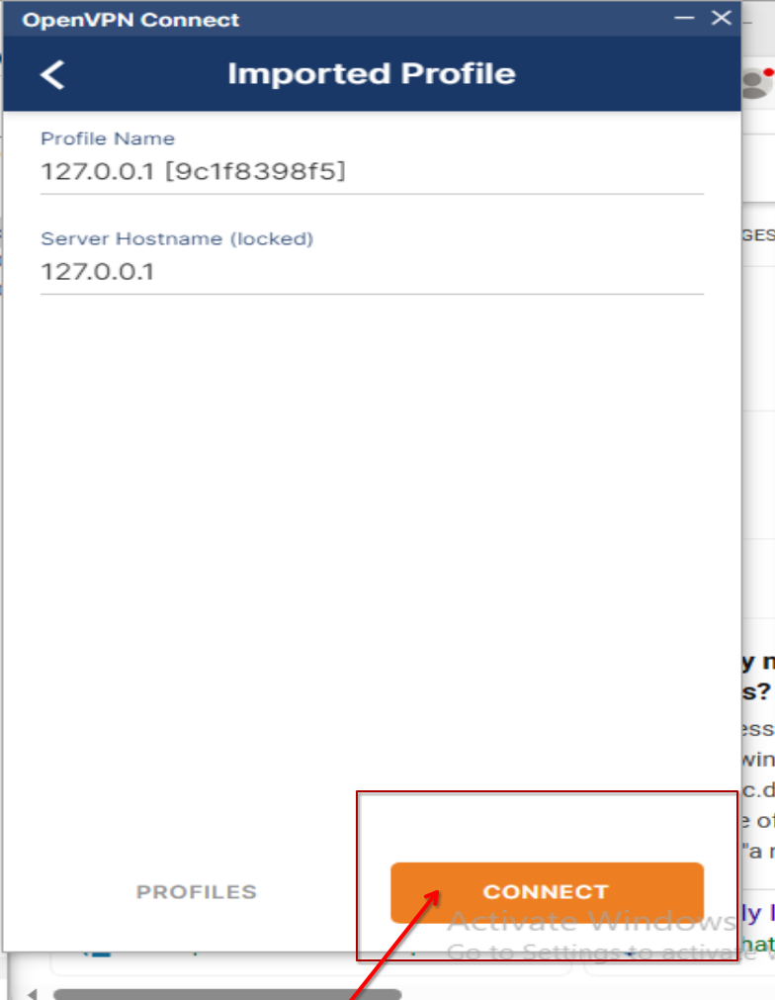

# Stealth Stream Installation Guide

1. Unzip the folder -- and you should have 3 files, 
    - Install
    - setup
    - Configuration for ur vpn-client

 

### Make sure to run the install as administrator

 

### You will see a screen similar to this, click at yes and the installation will begin

 

### cmd will pop up to install all the required files for the vpn to work -- (DO NOT CLOSE IT) -- This step might take a little long, depends on your internet speed.

 

 

 

 

 

 

 

### Note: Make sure the "Tools" Option is <b>NOT</b> selected 

 

 

 

### Note: Make sure the “Start stunnel after Installation” Option is NOT selected

 

 

### Now the Installation is completed, the following steps are for importing vpn config file

 

 

 

 

 

If u need any help, or encounter any problem, do not hasitate to contact us via telegram.. 

Join the group here: https://t.me/+_vdC2z4L53c3N2I1

## 
 Or Scan Qr Code

  

